# GLPI Quick Start

## Install glpi with Docker Compose

### Prerequisites

**Install Docker and Docker Compose**
- [Debian](https://docs.docker.com/engine/install/debian/)
- [Ubuntu](https://docs.docker.com/engine/install/ubuntu/)
- [CentOS](https://docs.docker.com/engine/install/centos/)
- [RHEL](https://docs.docker.com/engine/install/rhel/)

### 1. Set variables about DB in docker-compose.yml file
```
MYSQL_ROOT_PASSWORD: "<YOUR_MYSQL_ROOT_PASSWORD>"
MYSQL_DATABASE: "glpi"
MYSQL_USER: "glpi"
MYSQL_PASSWORD: "<YOUR_MYSQL_PASSWORD>"
```

### 2. Execute docker compose file
```bash
docker compose up -d
```

### 3. Connect your glpi server
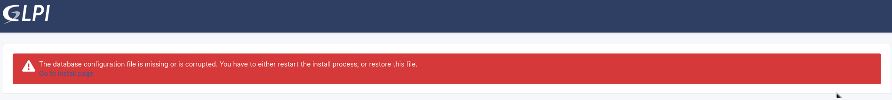


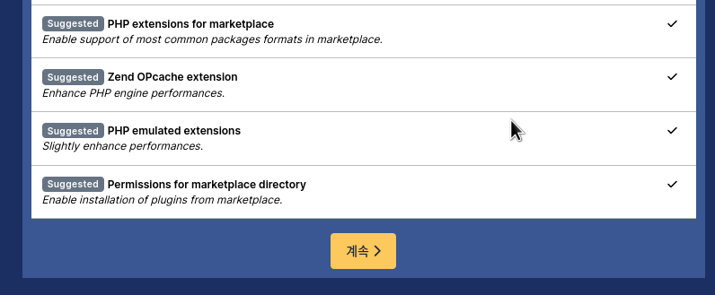


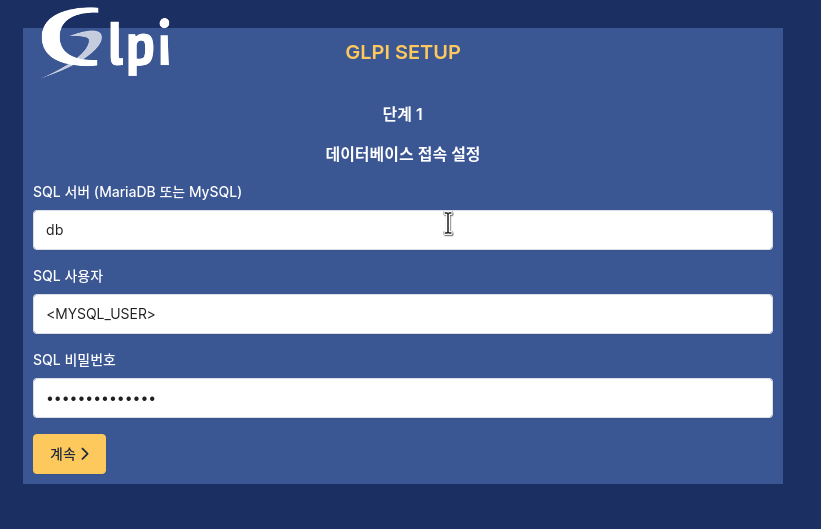

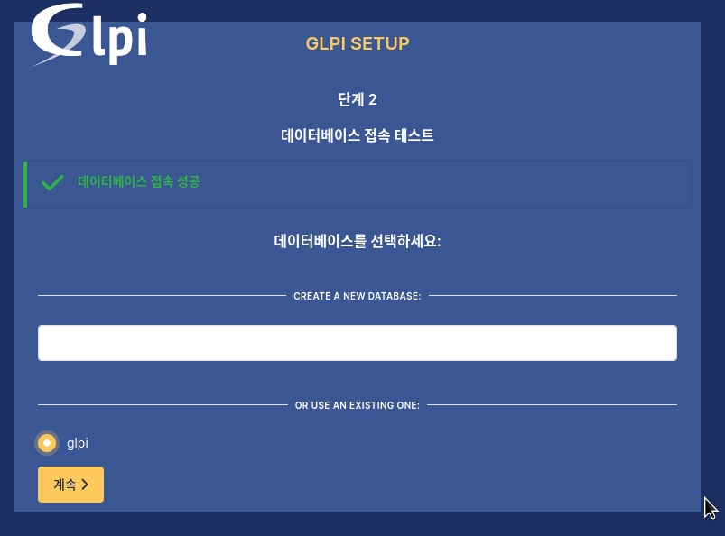

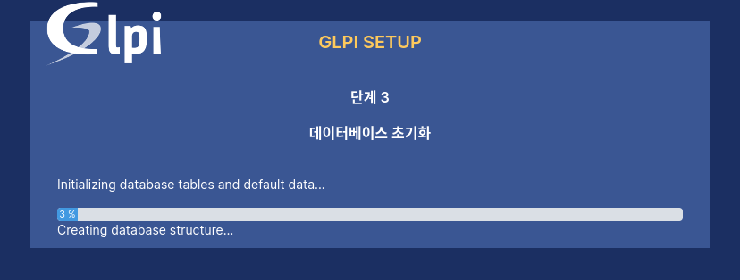

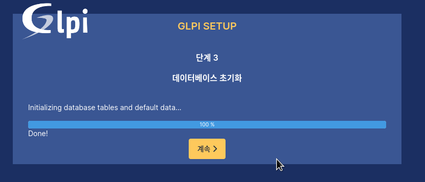

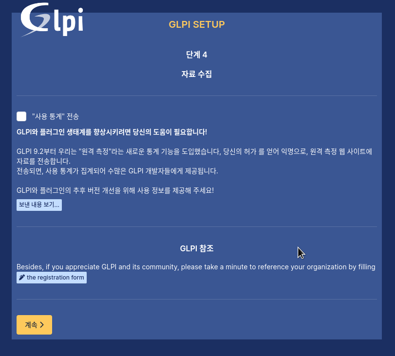

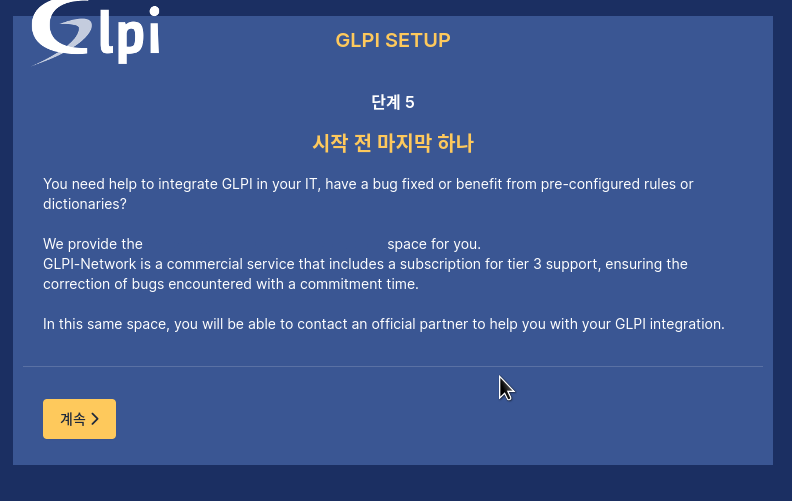

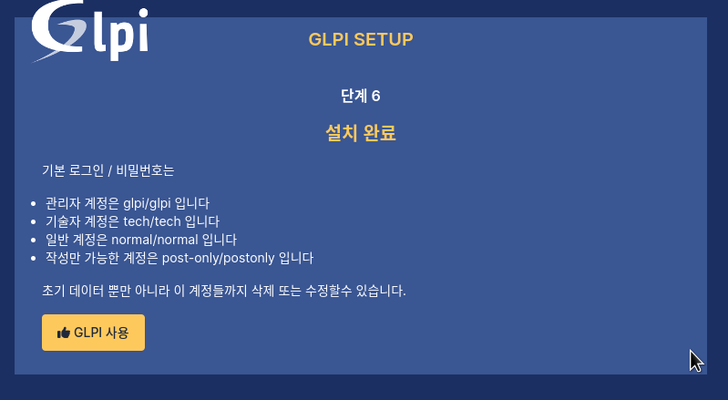

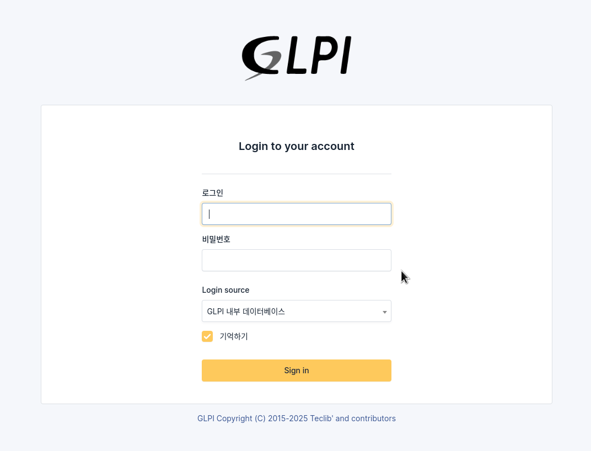

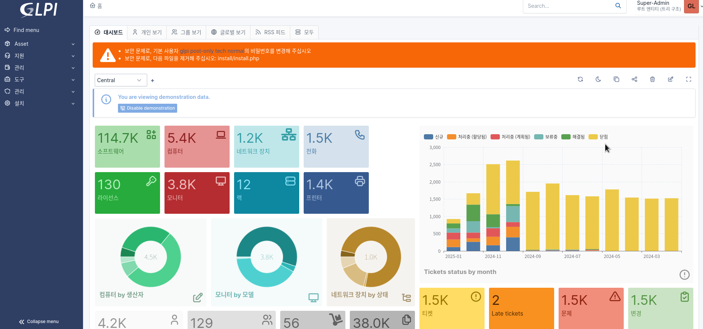